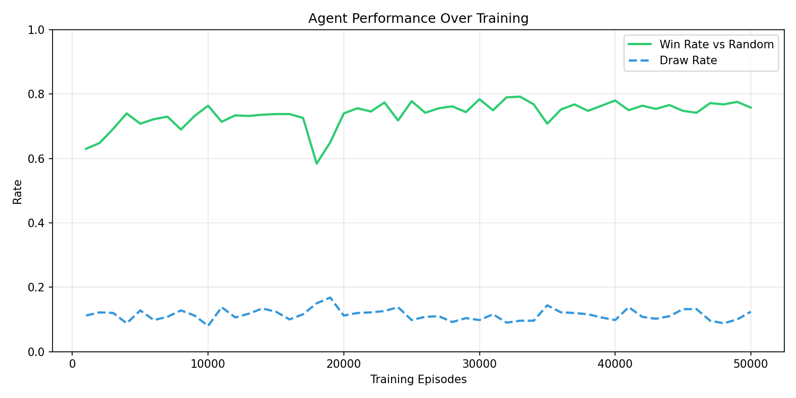

# 🎮 Tic-Tac-Toe RL Agent

A reinforcement learning agent that teaches itself to play Tic-Tac-Toe from scratch using **Q-Learning**. No rules are hard-coded — the agent starts knowing nothing and gradually figures out winning strategies through thousands of games of self-play.


---

## Table of Contents

- [About the Project](#-about-the-project)
- [Demo](#-demo)
- [Project Structure](#-project-structure)
- [Getting Started](#-getting-started)
- [Usage](#-usage)
- [How It Works](#-how-it-works)
- [Results](#-results)
- [Hyperparameter Experiments](#-hyperparameter-experiments)
- [What I Learned](#-what-i-learned)
- [Future Improvements](#-future-improvements)
- [Tech Stack](#-tech-stack)

---

## 🧠 About the Project

This project explores one of the fundamental ideas in reinforcement learning: **can an agent learn to play a game well just by playing against itself?**

The answer is yes. Using a Q-Learning algorithm with an epsilon-greedy exploration strategy, the agent learns to:

- Prefer the center square as an opening move (which is optimal)
- Value corners over edges
- Block the opponent from completing three-in-a-row
- Set up "fork" positions where it has two ways to win

The entire learning process is driven by a simple reward signal: +1 for winning, -1 for losing, +0.5 for drawing, and 0 for every other move. That's it. No game theory, no minimax, no hard-coded heuristics.

**Why this project?** Tic-Tac-Toe is small enough that Q-Learning can solve it with a lookup table (no neural networks needed), which makes the RL concepts easy to understand and debug. It's a great stepping stone before tackling more complex environments.

---

## 🎬 Demo

### Training Output
```
==================================================
  Tic-Tac-Toe Q-Learning Agent
==================================================
  Episodes:  30000
  LR:        0.1
  Gamma:     0.95
  Epsilon:   0.3
==================================================

Episode   1000/30000 | Win Rate: 52.6% | Draw Rate: 16.4% | Epsilon: 0.2714
Episode   5000/30000 | Win Rate: 71.0% | Draw Rate: 14.0% | Epsilon: 0.1820
Episode  10000/30000 | Win Rate: 74.8% | Draw Rate: 10.8% | Epsilon: 0.1104
Episode  20000/30000 | Win Rate: 71.4% | Draw Rate: 17.0% | Epsilon: 0.0406
Episode  30000/30000 | Win Rate: 73.4% | Draw Rate: 12.4% | Epsilon: 0.0149
```

### Training Curve

The agent's win rate against a random opponent over 30,000 episodes of training:



---

## 📁 Project Structure

```
tic-tac-toe-rl/
│
├── src/                        # Source code
│   ├── __init__.py
│   ├── environment.py          # Game environment (state, actions, rewards)
│   ├── agent.py                # Q-Learning agent + Random baseline agent
│   ├── train.py                # Training loop with self-play and evaluation
│   └── gui.py                  # CustomTkinter GUI to play against the agent
│
├── notebooks/
│   └── exploration.ipynb       # Analysis notebook with visualizations
│
├── models/
│   └── q_table.pkl             # Saved Q-table (generated after training)
│
├── tests/
│   └── test_environment.py     # Unit tests for game logic and agent
│
├── images/
│   └── training_curve.png      # Training performance plot
│
├── requirements.txt            # Python dependencies
├── .gitignore
└── README.md
```

### File Descriptions

| File | What It Does |
|------|-------------|
| `environment.py` | Implements the game board as a numpy array. Handles moves, win detection, turn switching, and rendering. The board state is a tuple of 9 values (0=empty, 1=X, -1=O) so it can be used as a dictionary key. |
| `agent.py` | The Q-Learning agent with an epsilon-greedy policy. Also includes a `RandomAgent` class used as a baseline opponent during evaluation. |
| `train.py` | Runs self-play training where the agent controls both players. Periodically evaluates against a random opponent and logs progress. Saves the Q-table and a training curve plot. |
| `gui.py` | CustomTkinter desktop GUI with a dark-themed game board, score tracking, win highlighting, and Easy/Hard difficulty toggle. |
| `exploration.ipynb` | Jupyter notebook that walks through training, compares hyperparameters, and visualizes what the agent learned (opening move preferences, Q-value heatmaps). |
| `test_environment.py` | 8 unit tests covering board state, win detection, draw detection, invalid moves, and a quick sanity check that the agent actually learns. |

---

## 🚀 Getting Started

### Prerequisites

- Python 3.8 or higher
- pip (Python package manager)
- **tkinter** (required for the GUI — usually bundled with Python, but not always on Linux)

**If you get `ModuleNotFoundError: No module named 'tkinter'`**, install it for your system:

```bash
# Ubuntu / Debian
sudo apt-get install python3-tk

# Fedora
sudo dnf install python3-tkinter

# Arch Linux
sudo pacman -S tk

# macOS (via Homebrew) — usually already included
brew install python-tk

# Windows — tkinter is included with the official Python installer.
# If missing, reinstall Python from python.org and check "tcl/tk" during setup.
```

### Installation

**1. Clone the repository**
```bash
git clone https://github.com/yourusername/tic-tac-toe-rl.git
cd tic-tac-toe-rl
```

**2. (Optional) Create a virtual environment**
```bash
python -m venv venv
source venv/bin/activate        # Linux/Mac
venv\Scripts\activate           # Windows
```

**3. Install dependencies**
```bash
pip install -r requirements.txt
```

That's it. No GPU needed, no large datasets to download.

---

## 💡 Usage

### Train the Agent

```bash
python src/train.py --episodes 50000 --lr 0.1 --epsilon 0.3
```

**Available arguments:**

| Argument | Default | Description |
|----------|---------|-------------|
| `--episodes` | 50000 | Number of self-play training games |
| `--lr` | 0.1 | Learning rate (alpha) — how fast the agent updates Q-values |
| `--gamma` | 0.95 | Discount factor — how much it values future rewards |
| `--epsilon` | 0.3 | Initial exploration rate — probability of random moves |

Training 50k episodes takes about 30-60 seconds on most machines.

**Output:**
- `models/q_table.pkl` — the learned Q-table
- `images/training_curve.png` — win rate over time

### Play Against the Agent (GUI)

```bash
python src/gui.py
```

The GUI features:
- **Dark-themed board** with clean X and O markers
- **Win highlighting** — the winning line lights up green or red
- **Score tracking** — wins, losses, and draws persist across rounds
- **Difficulty toggle** — switch between Easy (random opponent) and Hard (Q-learning agent)
- **New Game button** — restart without closing the window

### Run the Notebook

```bash
cd notebooks
jupyter notebook exploration.ipynb
```

The notebook includes:
- Environment walkthrough
- Full training with live progress
- Learning rate comparison (0.01 vs 0.1 vs 0.5)
- Q-value heatmap for opening moves

### Run Tests

```bash
python tests/test_environment.py
```

Or with pytest:
```bash
pytest tests/ -v
```

---

## 🔧 How It Works

### The Environment

The game is modeled as a standard RL environment with:

- **State**: A tuple of 9 integers representing the board. `(0, 0, 1, 0, -1, 0, 0, 0, 0)` means X is at position 2 and O is at position 4.
- **Actions**: Integers 0-8 representing board positions (only empty cells are valid).
- **Transitions**: Placing a mark, checking for win/draw, switching players.

### The Agent

The agent uses **tabular Q-Learning**, which maintains a dictionary (Q-table) mapping every `(state, action)` pair it has seen to an expected reward value.

**Action selection** uses epsilon-greedy:
```
if random() < epsilon:
    pick a random valid action          # explore
else:
    pick the action with highest Q-value  # exploit
```

**Learning update** after each move:
```
Q(s, a) ← Q(s, a) + α · [reward + γ · max Q(s', a') - Q(s, a)]
```

Where:
- `α` (learning rate) controls how much new info overrides old beliefs
- `γ` (discount factor) controls how much the agent cares about future vs immediate reward
- `max Q(s', a')` is the best expected value from the next state

### Reward Structure

| Outcome | Reward | Why |
|---------|--------|-----|
| Win | +1.0 | Obviously good |
| Lose | -1.0 | Obviously bad |
| Draw | +0.5 | Better than losing — draws against optimal play are the best possible outcome |
| Regular move | 0.0 | No intermediate reward — the agent learns to plan ahead |

### Self-Play Training

The key insight: the agent plays **both sides**. On each turn, it picks a move for the current player, then switches. After the game ends, it updates Q-values for both players' moves, assigning appropriate rewards (the loser gets -1.0 even though the winner got +1.0).

This forces the agent to learn both offensive and defensive strategies simultaneously.

### Epsilon Decay

Exploration rate starts at 0.3 (30% random moves) and decays by a factor of 0.9999 each episode, with a minimum of 0.01. This means:
- **Early training**: lots of random exploration, discovering new states
- **Late training**: mostly exploiting what it's learned, fine-tuning strategy

---

## 📊 Results

After 30,000 episodes of self-play training:

| Metric | Value |
|--------|-------|
| Win rate vs random opponent | **~73-76%** |
| Draw rate vs random opponent | **~11-14%** |
| Loss rate vs random opponent | **~12-15%** |
| Q-table size | ~12,600 entries |
| Training time | ~20 seconds |

### What the Agent Learned About Opening Moves

By inspecting Q-values for the empty board, we can see the agent's preferences:

```
Position 0 (corner):    High value ██████████
Position 1 (edge):      Low value  ███
Position 2 (corner):    High value ██████████
Position 3 (edge):      Low value  ███
Position 4 (center):    Highest    ████████████
Position 5 (edge):      Low value  ███
Position 6 (corner):    High value ██████████
Position 7 (edge):      Low value  ███
Position 8 (corner):    High value ██████████
```

This matches known Tic-Tac-Toe theory — the center is the strongest opening, corners are second best, and edges are weakest. The agent discovered this entirely on its own.

---

## 🔬 Hyperparameter Experiments

Tested three different learning rates with everything else held constant:

| Learning Rate | Win Rate @ 20k Episodes | Notes |
|--------------|------------------------|-------|
| 0.01 | ~55-60% | Too slow — doesn't converge in time |
| 0.10 | ~73-76% | Sweet spot — stable and effective |
| 0.50 | ~65-70% | Too aggressive — overshoots and oscillates |

**Key finding:** A learning rate of 0.1 gives the best balance between learning speed and stability. Too low and the agent barely improves; too high and it keeps overwriting good strategies with noisy updates.

---

## 📝 What I Learned

Building this project taught me several things about reinforcement learning in practice:

1. **State representation matters.** Using tuples as dictionary keys was a clean way to make states hashable for the Q-table. In larger games, this approach doesn't scale (hence deep RL).

2. **Self-play is surprisingly effective.** The agent doesn't need a pre-built opponent or labeled data. Playing against itself creates a natural curriculum — as it gets better, its opponent gets better too.

3. **Exploration vs exploitation is real.** Without enough exploration (low epsilon), the agent gets stuck in suboptimal strategies. Too much exploration and it never settles on good moves.

4. **Reward shaping changes behavior.** Giving +0.5 for draws (instead of 0) made the agent more defensive — it learned that drawing is better than taking risky moves that might lose.

5. **The Q-table gets big fast.** Even for 3x3 Tic-Tac-Toe, the table has ~12,000 entries. Chess or Go would be impossibly large, which is why deep Q-networks and policy gradient methods exist.

---

## 🔮 Future Improvements

Some ideas for extending this project:

- [ ] **Minimax comparison** — implement a minimax agent and compare it to the Q-learner
- [ ] **Deep Q-Network** — replace the Q-table with a neural network to handle larger boards (4x4, 5x5)
- [ ] **Policy gradient** — try REINFORCE or PPO instead of Q-learning
- [ ] **Web interface** — build a simple Flask/Streamlit app to play in the browser
- [ ] **Connect Four** — scale up to a more complex game with the same framework
- [ ] **Training visualization** — animate how Q-values evolve during training

---

## 🛠️ Tech Stack

| Tool | Purpose |
|------|---------|
| Python 3.8+ | Core language |
| NumPy | Board state representation and array operations |
| CustomTkinter | Modern desktop GUI for playing against the agent |
| Matplotlib | Training curves and Q-value heatmaps |
| Pickle | Saving and loading the Q-table |
| Pytest | Unit testing |
| Jupyter | Interactive exploration and analysis |

---

*Built as part of my ML portfolio. If you found this useful or have suggestions, feel free to open an issue or reach out!*
